<!--
File: docs/architecture/MAP_GRAPH.md
Description: 🌐 ĐỒ THỊ LIÊN KẾT CODEBASE MARKDOWN VIEWER
CHANGELOG:
- 14:55:00 02/07/2026: [UPDATE] Cập nhật đồ thị sang backend/frontend của dự án Markdown Viewer (Lê Thanh Vân/Antigravity)
-->

# 🌐 ĐỒ THỊ LIÊN KẾT CODEBASE MARKDOWN VIEWER

> [!TIP]
> Tài liệu này được tự động cập nhật bằng cơ chế **Incremental Cache** siêu tốc.
> Giúp hình dung rõ ràng mối liên kết gọi hàm và kế thừa trong toàn bộ hệ thống Markdown Viewer.

---

## 💾 1. Đồ thị liên kết Backend & Core (Phân tích cú pháp Markdown, Latex, Mermaid)

```mermaid
graph TD
    classDef file fill:#f9f,stroke:#333,stroke-width:1px;
    classDef cls fill:#bbf,stroke:#333,stroke-width:1px;
    classDef func fill:#bfb,stroke:#333,stroke-width:1px;
    config["📄 config.py"]:::file
    config_get_api_key["⚙️ get_api_key()"]:::func
    main["📄 main.py"]:::file
    main_ApplicationController["🧩 ApplicationController"]:::cls
    main_ApplicationController___init__["⚙️ __init__()"]:::func
    main_ApplicationController_run["⚙️ run()"]:::func
    main_ApplicationController_on_startup_finished["⚙️ on_startup_finished()"]:::func
    main_ApplicationController_on_startup_error["⚙️ on_startup_error()"]:::func
    main_main["⚙️ main()"]:::func
    backend_ai_service["📄 ai_service.py"]:::file
    backend_ai_service_AIServiceWorker["🧩 AIServiceWorker"]:::cls
    backend_ai_service_normalize_data["⚙️ normalize_data()"]:::func
    backend_ai_service_AIServiceWorker___init__["⚙️ __init__()"]:::func
    backend_ai_service_AIServiceWorker_run["⚙️ run()"]:::func
    backend_database["📄 database.py"]:::file
    backend_database_get_db_connection["⚙️ get_db_connection()"]:::func
    backend_database_db_session["⚙️ db_session()"]:::func
    backend_database_init_db["⚙️ init_db()"]:::func
    backend_database_run_database_cleanup["⚙️ run_database_cleanup()"]:::func
    backend_database_add_book["⚙️ add_book()"]:::func
    backend_database_get_book_by_id["⚙️ get_book_by_id()"]:::func
    backend_database_get_filtered_books["⚙️ get_filtered_books()"]:::func
    backend_database_update_book_field["⚙️ update_book_field()"]:::func
    backend_database_delete_book["⚙️ delete_book()"]:::func
    backend_database_get_distinct_column_values["⚙️ get_distinct_column_values()"]:::func
    backend_database_get_library_stats["⚙️ get_library_stats()"]:::func
    backend_database_get_dashboard_stats["⚙️ get_dashboard_stats()"]:::func
    backend_data_model["📄 data_model.py"]:::file
    backend_data_model_get_db_columns["⚙️ get_db_columns()"]:::func
    backend_data_model_get_column_headers["⚙️ get_column_headers()"]:::func
    backend_data_model_get_ai_to_db_key_map["⚙️ get_ai_to_db_key_map()"]:::func
    backend_data_model_get_form_fields["⚙️ get_form_fields()"]:::func
    backend_excel_service["📄 excel_service.py"]:::file
    backend_excel_service_export_to_excel_file["⚙️ export_to_excel_file()"]:::func
    backend_rag_service["📄 rag_service.py"]:::file
    backend_rag_service_ChatWorker["🧩 ChatWorker"]:::cls
    backend_rag_service_embed_and_store_book["⚙️ embed_and_store_book()"]:::func
    backend_rag_service_remove_book_from_chroma["⚙️ remove_book_from_chroma()"]:::func
    backend_rag_service_sync_database_with_chroma["⚙️ sync_database_with_chroma()"]:::func
    backend_rag_service_query_relevant_books["⚙️ query_relevant_books()"]:::func
    backend_rag_service_ChatWorker___init__["⚙️ __init__()"]:::func
    backend_rag_service_ChatWorker_run["⚙️ run()"]:::func
    backend_startup_worker["📄 startup_worker.py"]:::file
    backend_startup_worker_StartupWorker["🧩 StartupWorker"]:::cls
    backend_startup_worker_StartupWorker___init__["⚙️ __init__()"]:::func
    backend_startup_worker_StartupWorker_run["⚙️ run()"]:::func
    backend_utils["📄 utils.py"]:::file
    backend_utils_find_cover_image["⚙️ find_cover_image()"]:::func
    backend_utils_create_thumbnail["⚙️ create_thumbnail()"]:::func
    backend_utils_get_thumbnail_path["⚙️ get_thumbnail_path()"]:::func
    backend_utils_rotate_image_file["⚙️ rotate_image_file()"]:::func
    backend___init__["📄 __init__.py"]:::file
    config -->|contains| config_get_api_key
    main -->|contains| main_ApplicationController
    main_ApplicationController -->|contains| main_ApplicationController___init__
    main_ApplicationController -->|contains| main_ApplicationController_run
    main_ApplicationController -->|contains| main_ApplicationController_on_startup_finished
    main_ApplicationController -->|contains| main_ApplicationController_on_startup_error
    main -->|contains| main_main
    backend_ai_service -->|contains| backend_ai_service_AIServiceWorker
    backend_ai_service -->|contains| backend_ai_service_normalize_data
    backend_ai_service_AIServiceWorker -->|contains| backend_ai_service_AIServiceWorker___init__
    backend_ai_service_AIServiceWorker -->|contains| backend_ai_service_AIServiceWorker_run
    backend_database -->|contains| backend_database_get_db_connection
    backend_database -->|contains| backend_database_db_session
    backend_database -->|contains| backend_database_init_db
    backend_database -->|contains| backend_database_run_database_cleanup
    backend_database -->|contains| backend_database_add_book
    backend_database -->|contains| backend_database_get_book_by_id
    backend_database -->|contains| backend_database_get_filtered_books
    backend_database -->|contains| backend_database_update_book_field
    backend_database -->|contains| backend_database_delete_book
    backend_database -->|contains| backend_database_get_distinct_column_values
    backend_database -->|contains| backend_database_get_library_stats
    backend_database -->|contains| backend_database_get_dashboard_stats
    backend_data_model -->|contains| backend_data_model_get_db_columns
    backend_data_model -->|contains| backend_data_model_get_column_headers
    backend_data_model -->|contains| backend_data_model_get_ai_to_db_key_map
    backend_data_model -->|contains| backend_data_model_get_form_fields
    backend_excel_service -->|contains| backend_excel_service_export_to_excel_file
    backend_rag_service -->|contains| backend_rag_service_ChatWorker
    backend_rag_service -->|contains| backend_rag_service_embed_and_store_book
    backend_rag_service -->|contains| backend_rag_service_remove_book_from_chroma
    backend_rag_service -->|contains| backend_rag_service_sync_database_with_chroma
    backend_rag_service -->|contains| backend_rag_service_query_relevant_books
    backend_rag_service_ChatWorker -->|contains| backend_rag_service_ChatWorker___init__
    backend_rag_service_ChatWorker -->|contains| backend_rag_service_ChatWorker_run
    backend_startup_worker -->|contains| backend_startup_worker_StartupWorker
    backend_startup_worker_StartupWorker -->|contains| backend_startup_worker_StartupWorker___init__
    backend_startup_worker_StartupWorker -->|contains| backend_startup_worker_StartupWorker_run
    backend_utils -->|contains| backend_utils_find_cover_image
    backend_utils -->|contains| backend_utils_create_thumbnail
    backend_utils -->|contains| backend_utils_get_thumbnail_path
    backend_utils -->|contains| backend_utils_rotate_image_file
    main_ApplicationController_run ==>|calls| backend_startup_worker_StartupWorker
    main_main ==>|calls| main_ApplicationController
    main_main ==>|calls| main_ApplicationController_run
    backend_ai_service_AIServiceWorker_run ==>|calls| config_get_api_key
    backend_ai_service_AIServiceWorker_run ==>|calls| backend_ai_service_normalize_data
    backend_database_db_session ==>|calls| backend_database_get_db_connection
    backend_database_init_db ==>|calls| backend_database_db_session
    backend_database_run_database_cleanup ==>|calls| backend_database_db_session
    backend_database_add_book ==>|calls| backend_database_db_session
    backend_database_add_book ==>|calls| backend_data_model_get_db_columns
    backend_database_get_book_by_id ==>|calls| backend_database_db_session
    backend_database_get_filtered_books ==>|calls| backend_database_db_session
    backend_database_update_book_field ==>|calls| backend_database_db_session
    backend_database_delete_book ==>|calls| backend_database_db_session
    backend_database_get_distinct_column_values ==>|calls| backend_database_db_session
    backend_database_get_library_stats ==>|calls| backend_database_db_session
    backend_database_get_dashboard_stats ==>|calls| backend_database_db_session
    backend_rag_service_embed_and_store_book ==>|calls| backend_database_get_book_by_id
    backend_rag_service_sync_database_with_chroma ==>|calls| backend_database_get_db_connection
    backend_rag_service_sync_database_with_chroma ==>|calls| backend_rag_service_embed_and_store_book
    backend_rag_service_query_relevant_books ==>|calls| backend_database_get_book_by_id
    backend_rag_service_ChatWorker_run ==>|calls| backend_rag_service_query_relevant_books
    backend_startup_worker_StartupWorker_run ==>|calls| backend_database_init_db
    backend_startup_worker_StartupWorker_run ==>|calls| backend_database_run_database_cleanup
    backend_startup_worker_StartupWorker_run ==>|calls| backend_rag_service_sync_database_with_chroma
    backend_utils_get_thumbnail_path ==>|calls| backend_utils_create_thumbnail
```


---

## 🎨 2. Đồ thị liên kết Frontend PyQt6 (Giao diện Markdown Viewer)
```mermaid
graph TD
    classDef file fill:#f9f,stroke:#333,stroke-width:1px;
    classDef cls fill:#bbf,stroke:#333,stroke-width:1px;
    classDef func fill:#bfb,stroke:#333,stroke-width:1px;
    frontend_excel_worker["📄 excel_worker.py"]:::file
    frontend_excel_worker_ExcelExportWorker["🧩 ExcelExportWorker"]:::cls
    frontend_excel_worker_ExcelExportWorker___init__["⚙️ __init__()"]:::func
    frontend_excel_worker_ExcelExportWorker_run["⚙️ run()"]:::func
    frontend_main_window["📄 main_window.py"]:::file
    frontend_main_window_MainWindow["🧩 MainWindow"]:::cls
    frontend_main_window_MainWindow___init__["⚙️ __init__()"]:::func
    frontend_main_window_MainWindow_initUI["⚙️ initUI()"]:::func
    frontend_main_window_MainWindow_setup_control_bar["⚙️ setup_control_bar()"]:::func
    frontend_main_window_MainWindow_setup_status_area["⚙️ setup_status_area()"]:::func
    frontend_main_window_MainWindow_connect_signals["⚙️ connect_signals()"]:::func
    frontend_main_window_MainWindow_on_thumbnail_refresh_requested["⚙️ on_thumbnail_refresh_requested()"]:::func
    frontend_main_window_MainWindow_on_header_filter_applied["⚙️ on_header_filter_applied()"]:::func
    frontend_main_window_MainWindow_show_add_manual_dialog["⚙️ show_add_manual_dialog()"]:::func
    frontend_main_window_MainWindow_setup_export_menu["⚙️ setup_export_menu()"]:::func
    frontend_main_window_MainWindow_on_header_clicked["⚙️ on_header_clicked()"]:::func
    frontend_main_window_MainWindow_toggle_view["⚙️ toggle_view()"]:::func
    frontend_main_window_MainWindow_toggle_dashboard["⚙️ toggle_dashboard()"]:::func
    frontend_main_window_MainWindow_load_books_from_db["⚙️ load_books_from_db()"]:::func
    frontend_main_window_MainWindow_apply_filters_debounced["⚙️ apply_filters_debounced()"]:::func
    frontend_main_window_MainWindow_trigger_filter["⚙️ trigger_filter()"]:::func
    frontend_main_window_MainWindow_start_processing["⚙️ start_processing()"]:::func
    frontend_main_window_MainWindow_process_next_in_queue["⚙️ process_next_in_queue()"]:::func
    frontend_main_window_MainWindow_update_progress["⚙️ update_progress()"]:::func
    frontend_main_window_MainWindow_on_error["⚙️ on_error()"]:::func
    frontend_main_window_MainWindow_on_processing_finished["⚙️ on_processing_finished()"]:::func
    frontend_main_window_MainWindow_process_image_file["⚙️ process_image_file()"]:::func
    frontend_main_window_MainWindow_update_status_bar["⚙️ update_status_bar()"]:::func
    frontend_main_window_MainWindow_display_book_dialog["⚙️ display_book_dialog()"]:::func
    frontend_main_window_MainWindow_show_full_size_image["⚙️ show_full_size_image()"]:::func
    frontend_main_window_MainWindow_show_error["⚙️ show_error()"]:::func
    frontend_main_window_MainWindow_resizeEvent["⚙️ resizeEvent()"]:::func
    frontend_main_window_MainWindow_closeEvent["⚙️ closeEvent()"]:::func
    frontend_main_window_MainWindow_save_settings["⚙️ save_settings()"]:::func
    frontend_main_window_MainWindow_load_settings["⚙️ load_settings()"]:::func
    frontend_main_window_MainWindow_export_selected_to_excel["⚙️ export_selected_to_excel()"]:::func
    frontend_main_window_MainWindow_export_all_to_excel["⚙️ export_all_to_excel()"]:::func
    frontend_main_window_MainWindow_export_to_excel["⚙️ export_to_excel()"]:::func
    frontend_main_window_MainWindow_on_export_finished["⚙️ on_export_finished()"]:::func
    frontend_main_window_MainWindow_on_export_error["⚙️ on_export_error()"]:::func
    frontend_splash_screen["📄 splash_screen.py"]:::file
    frontend_splash_screen_SplashScreen["🧩 SplashScreen"]:::cls
    frontend_splash_screen_SplashScreen___init__["⚙️ __init__()"]:::func
    frontend_splash_screen_SplashScreen_setup_ui["⚙️ setup_ui()"]:::func
    frontend_splash_screen_SplashScreen_center_on_screen["⚙️ center_on_screen()"]:::func
    frontend_splash_screen_SplashScreen_update_progress["⚙️ update_progress()"]:::func
    frontend_styles["📄 styles.py"]:::file
    frontend_widgets["📄 widgets.py"]:::file
    frontend_widgets_ClickableLabel["🧩 ClickableLabel"]:::cls
    frontend_widgets_GalleryItemWidget["🧩 GalleryItemWidget"]:::cls
    frontend_widgets_ClickableLabel___init__["⚙️ __init__()"]:::func
    frontend_widgets_ClickableLabel_mouseDoubleClickEvent["⚙️ mouseDoubleClickEvent()"]:::func
    frontend_widgets_GalleryItemWidget___init__["⚙️ __init__()"]:::func
    frontend___init__["📄 __init__.py"]:::file
    frontend_components_add_book_dialog["📄 add_book_dialog.py"]:::file
    frontend_components_add_book_dialog_AddBookDialog["🧩 AddBookDialog"]:::cls
    frontend_components_add_book_dialog_AddBookDialog___init__["⚙️ __init__()"]:::func
    frontend_components_add_book_dialog_AddBookDialog_initUI["⚙️ initUI()"]:::func
    frontend_components_add_book_dialog_AddBookDialog_on_accept["⚙️ on_accept()"]:::func
    frontend_components_add_book_dialog_AddBookDialog_get_book_data["⚙️ get_book_data()"]:::func
    frontend_components_banner_widget["📄 banner_widget.py"]:::file
    frontend_components_banner_widget_BannerWidget["🧩 BannerWidget"]:::cls
    frontend_components_banner_widget_BannerWidget___init__["⚙️ __init__()"]:::func
    frontend_components_banner_widget_BannerWidget_initUI["⚙️ initUI()"]:::func
    frontend_components_banner_widget_BannerWidget_add_banner_images["⚙️ add_banner_images()"]:::func
    frontend_components_banner_widget_BannerWidget_clear_banner_images["⚙️ clear_banner_images()"]:::func
    frontend_components_banner_widget_BannerWidget_load_banner_images["⚙️ load_banner_images()"]:::func
    frontend_components_banner_widget_BannerWidget_refresh_banner["⚙️ refresh_banner()"]:::func
    frontend_components_book_detail_dialog["📄 book_detail_dialog.py"]:::file
    frontend_components_book_detail_dialog_BookDetailDialog["🧩 BookDetailDialog"]:::cls
    frontend_components_book_detail_dialog_BookDetailDialog___init__["⚙️ __init__()"]:::func
    frontend_components_book_detail_dialog_BookDetailDialog_initUI["⚙️ initUI()"]:::func
    frontend_components_book_gallery_widget["📄 book_gallery_widget.py"]:::file
    frontend_components_book_gallery_widget_BookGalleryWidget["🧩 BookGalleryWidget"]:::cls
    frontend_components_book_gallery_widget_BookGalleryWidget___init__["⚙️ __init__()"]:::func
    frontend_components_book_gallery_widget_BookGalleryWidget_initUI["⚙️ initUI()"]:::func
    frontend_components_book_gallery_widget_BookGalleryWidget_display_books["⚙️ display_books()"]:::func
    frontend_components_book_gallery_widget_BookGalleryWidget__on_item_double_clicked["⚙️ _on_item_double_clicked()"]:::func
    frontend_components_book_table_widget["📄 book_table_widget.py"]:::file
    frontend_components_book_table_widget_BookTableWidget["🧩 BookTableWidget"]:::cls
    frontend_components_book_table_widget_BookTableWidget___init__["⚙️ __init__()"]:::func
    frontend_components_book_table_widget_BookTableWidget_initUI["⚙️ initUI()"]:::func
    frontend_components_book_table_widget_BookTableWidget_display_books["⚙️ display_books()"]:::func
    frontend_components_book_table_widget_BookTableWidget_add_book_to_table["⚙️ add_book_to_table()"]:::func
    frontend_components_book_table_widget_BookTableWidget_show_header_context_menu["⚙️ show_header_context_menu()"]:::func
    frontend_components_book_table_widget_BookTableWidget_show_row_context_menu["⚙️ show_row_context_menu()"]:::func
    frontend_components_book_table_widget_BookTableWidget_delete_selected_book["⚙️ delete_selected_book()"]:::func
    frontend_components_book_table_widget_BookTableWidget_on_cell_changed["⚙️ on_cell_changed()"]:::func
    frontend_components_book_table_widget_BookTableWidget_on_cell_double_clicked["⚙️ on_cell_double_clicked()"]:::func
    frontend_components_book_table_widget_BookTableWidget_show_status_menu["⚙️ show_status_menu()"]:::func
    frontend_components_book_table_widget_BookTableWidget_update_status["⚙️ update_status()"]:::func
    frontend_components_book_table_widget_BookTableWidget_update_status_reading["⚙️ update_status_reading()"]:::func
    frontend_components_chat_widget["📄 chat_widget.py"]:::file
    frontend_components_chat_widget_ChatWidget["🧩 ChatWidget"]:::cls
    frontend_components_chat_widget_ChatWidget___init__["⚙️ __init__()"]:::func
    frontend_components_chat_widget_ChatWidget_initUI["⚙️ initUI()"]:::func
    frontend_components_chat_widget_ChatWidget_send_chat_message["⚙️ send_chat_message()"]:::func
    frontend_components_chat_widget_ChatWidget_on_chat_response["⚙️ on_chat_response()"]:::func
    frontend_components_chat_widget_ChatWidget_on_chat_error["⚙️ on_chat_error()"]:::func
    frontend_components_dashboard_widget["📄 dashboard_widget.py"]:::file
    frontend_components_dashboard_widget_ChartCanvas["🧩 ChartCanvas"]:::cls
    frontend_components_dashboard_widget_ChartDetailDialog["🧩 ChartDetailDialog"]:::cls
    frontend_components_dashboard_widget_ChartPreviewCard["🧩 ChartPreviewCard"]:::cls
    frontend_components_dashboard_widget_DashboardWidget["🧩 DashboardWidget"]:::cls
    frontend_components_dashboard_widget_ChartCanvas___init__["⚙️ __init__()"]:::func
    frontend_components_dashboard_widget_ChartDetailDialog___init__["⚙️ __init__()"]:::func
    frontend_components_dashboard_widget_ChartPreviewCard___init__["⚙️ __init__()"]:::func
    frontend_components_dashboard_widget_ChartPreviewCard_mousePressEvent["⚙️ mousePressEvent()"]:::func
    frontend_components_dashboard_widget_DashboardWidget___init__["⚙️ __init__()"]:::func
    frontend_components_dashboard_widget_DashboardWidget_initUI["⚙️ initUI()"]:::func
    frontend_components_dashboard_widget_DashboardWidget_refresh_data["⚙️ refresh_data()"]:::func
    frontend_components_dashboard_widget_DashboardWidget_show_detail["⚙️ show_detail()"]:::func
    frontend_components_dashboard_widget_DashboardWidget_plot_genres["⚙️ plot_genres()"]:::func
    frontend_components_dashboard_widget_DashboardWidget_plot_status["⚙️ plot_status()"]:::func
    frontend_components_dashboard_widget_DashboardWidget_plot_authors["⚙️ plot_authors()"]:::func
    frontend_components_dashboard_widget_DashboardWidget_plot_years["⚙️ plot_years()"]:::func
    frontend_components_dashboard_widget_DashboardWidget_plot_countries["⚙️ plot_countries()"]:::func
    frontend_components___init__["📄 __init__.py"]:::file
    frontend_excel_worker -->|contains| frontend_excel_worker_ExcelExportWorker
    frontend_excel_worker_ExcelExportWorker -->|contains| frontend_excel_worker_ExcelExportWorker___init__
    frontend_excel_worker_ExcelExportWorker -->|contains| frontend_excel_worker_ExcelExportWorker_run
    frontend_main_window -->|contains| frontend_main_window_MainWindow
    frontend_main_window_MainWindow -->|contains| frontend_main_window_MainWindow___init__
    frontend_main_window_MainWindow -->|contains| frontend_main_window_MainWindow_initUI
    frontend_main_window_MainWindow -->|contains| frontend_main_window_MainWindow_setup_control_bar
    frontend_main_window_MainWindow -->|contains| frontend_main_window_MainWindow_setup_status_area
    frontend_main_window_MainWindow -->|contains| frontend_main_window_MainWindow_connect_signals
    frontend_main_window_MainWindow -->|contains| frontend_main_window_MainWindow_on_thumbnail_refresh_requested
    frontend_main_window_MainWindow -->|contains| frontend_main_window_MainWindow_on_header_filter_applied
    frontend_main_window_MainWindow -->|contains| frontend_main_window_MainWindow_show_add_manual_dialog
    frontend_main_window_MainWindow -->|contains| frontend_main_window_MainWindow_setup_export_menu
    frontend_main_window_MainWindow -->|contains| frontend_main_window_MainWindow_on_header_clicked
    frontend_main_window_MainWindow -->|contains| frontend_main_window_MainWindow_toggle_view
    frontend_main_window_MainWindow -->|contains| frontend_main_window_MainWindow_toggle_dashboard
    frontend_main_window_MainWindow -->|contains| frontend_main_window_MainWindow_load_books_from_db
    frontend_main_window_MainWindow -->|contains| frontend_main_window_MainWindow_apply_filters_debounced
    frontend_main_window_MainWindow -->|contains| frontend_main_window_MainWindow_trigger_filter
    frontend_main_window_MainWindow -->|contains| frontend_main_window_MainWindow_start_processing
    frontend_main_window_MainWindow -->|contains| frontend_main_window_MainWindow_process_next_in_queue
    frontend_main_window_MainWindow -->|contains| frontend_main_window_MainWindow_update_progress
    frontend_main_window_MainWindow -->|contains| frontend_main_window_MainWindow_on_error
    frontend_main_window_MainWindow -->|contains| frontend_main_window_MainWindow_on_processing_finished
    frontend_main_window_MainWindow -->|contains| frontend_main_window_MainWindow_process_image_file
    frontend_main_window_MainWindow -->|contains| frontend_main_window_MainWindow_update_status_bar
    frontend_main_window_MainWindow -->|contains| frontend_main_window_MainWindow_display_book_dialog
    frontend_main_window_MainWindow -->|contains| frontend_main_window_MainWindow_show_full_size_image
    frontend_main_window_MainWindow -->|contains| frontend_main_window_MainWindow_show_error
    frontend_main_window_MainWindow -->|contains| frontend_main_window_MainWindow_resizeEvent
    frontend_main_window_MainWindow -->|contains| frontend_main_window_MainWindow_closeEvent
    frontend_main_window_MainWindow -->|contains| frontend_main_window_MainWindow_save_settings
    frontend_main_window_MainWindow -->|contains| frontend_main_window_MainWindow_load_settings
    frontend_main_window_MainWindow -->|contains| frontend_main_window_MainWindow_export_selected_to_excel
    frontend_main_window_MainWindow -->|contains| frontend_main_window_MainWindow_export_all_to_excel
    frontend_main_window_MainWindow -->|contains| frontend_main_window_MainWindow_export_to_excel
    frontend_main_window_MainWindow -->|contains| frontend_main_window_MainWindow_on_export_finished
    frontend_main_window_MainWindow -->|contains| frontend_main_window_MainWindow_on_export_error
    frontend_splash_screen -->|contains| frontend_splash_screen_SplashScreen
    frontend_splash_screen_SplashScreen -->|contains| frontend_splash_screen_SplashScreen___init__
    frontend_splash_screen_SplashScreen -->|contains| frontend_splash_screen_SplashScreen_setup_ui
    frontend_splash_screen_SplashScreen -->|contains| frontend_splash_screen_SplashScreen_center_on_screen
    frontend_splash_screen_SplashScreen -->|contains| frontend_splash_screen_SplashScreen_update_progress
    frontend_widgets -->|contains| frontend_widgets_ClickableLabel
    frontend_widgets -->|contains| frontend_widgets_GalleryItemWidget
    frontend_widgets_ClickableLabel -->|contains| frontend_widgets_ClickableLabel___init__
    frontend_widgets_ClickableLabel -->|contains| frontend_widgets_ClickableLabel_mouseDoubleClickEvent
    frontend_widgets_GalleryItemWidget -->|contains| frontend_widgets_GalleryItemWidget___init__
    frontend_components_add_book_dialog -->|contains| frontend_components_add_book_dialog_AddBookDialog
    frontend_components_add_book_dialog_AddBookDialog -->|contains| frontend_components_add_book_dialog_AddBookDialog___init__
    frontend_components_add_book_dialog_AddBookDialog -->|contains| frontend_components_add_book_dialog_AddBookDialog_initUI
    frontend_components_add_book_dialog_AddBookDialog -->|contains| frontend_components_add_book_dialog_AddBookDialog_on_accept
    frontend_components_add_book_dialog_AddBookDialog -->|contains| frontend_components_add_book_dialog_AddBookDialog_get_book_data
    frontend_components_banner_widget -->|contains| frontend_components_banner_widget_BannerWidget
    frontend_components_banner_widget_BannerWidget -->|contains| frontend_components_banner_widget_BannerWidget___init__
    frontend_components_banner_widget_BannerWidget -->|contains| frontend_components_banner_widget_BannerWidget_initUI
    frontend_components_banner_widget_BannerWidget -->|contains| frontend_components_banner_widget_BannerWidget_add_banner_images
    frontend_components_banner_widget_BannerWidget -->|contains| frontend_components_banner_widget_BannerWidget_clear_banner_images
    frontend_components_banner_widget_BannerWidget -->|contains| frontend_components_banner_widget_BannerWidget_load_banner_images
    frontend_components_banner_widget_BannerWidget -->|contains| frontend_components_banner_widget_BannerWidget_refresh_banner
    frontend_components_book_detail_dialog -->|contains| frontend_components_book_detail_dialog_BookDetailDialog
    frontend_components_book_detail_dialog_BookDetailDialog -->|contains| frontend_components_book_detail_dialog_BookDetailDialog___init__
    frontend_components_book_detail_dialog_BookDetailDialog -->|contains| frontend_components_book_detail_dialog_BookDetailDialog_initUI
    frontend_components_book_gallery_widget -->|contains| frontend_components_book_gallery_widget_BookGalleryWidget
    frontend_components_book_gallery_widget_BookGalleryWidget -->|contains| frontend_components_book_gallery_widget_BookGalleryWidget___init__
    frontend_components_book_gallery_widget_BookGalleryWidget -->|contains| frontend_components_book_gallery_widget_BookGalleryWidget_initUI
    frontend_components_book_gallery_widget_BookGalleryWidget -->|contains| frontend_components_book_gallery_widget_BookGalleryWidget_display_books
    frontend_components_book_gallery_widget_BookGalleryWidget -->|contains| frontend_components_book_gallery_widget_BookGalleryWidget__on_item_double_clicked
    frontend_components_book_table_widget -->|contains| frontend_components_book_table_widget_BookTableWidget
    frontend_components_book_table_widget_BookTableWidget -->|contains| frontend_components_book_table_widget_BookTableWidget___init__
    frontend_components_book_table_widget_BookTableWidget -->|contains| frontend_components_book_table_widget_BookTableWidget_initUI
    frontend_components_book_table_widget_BookTableWidget -->|contains| frontend_components_book_table_widget_BookTableWidget_display_books
    frontend_components_book_table_widget_BookTableWidget -->|contains| frontend_components_book_table_widget_BookTableWidget_add_book_to_table
    frontend_components_book_table_widget_BookTableWidget -->|contains| frontend_components_book_table_widget_BookTableWidget_show_header_context_menu
    frontend_components_book_table_widget_BookTableWidget -->|contains| frontend_components_book_table_widget_BookTableWidget_show_row_context_menu
    frontend_components_book_table_widget_BookTableWidget -->|contains| frontend_components_book_table_widget_BookTableWidget_delete_selected_book
    frontend_components_book_table_widget_BookTableWidget -->|contains| frontend_components_book_table_widget_BookTableWidget_on_cell_changed
    frontend_components_book_table_widget_BookTableWidget -->|contains| frontend_components_book_table_widget_BookTableWidget_on_cell_double_clicked
    frontend_components_book_table_widget_BookTableWidget -->|contains| frontend_components_book_table_widget_BookTableWidget_show_status_menu
    frontend_components_book_table_widget_BookTableWidget -->|contains| frontend_components_book_table_widget_BookTableWidget_update_status
    frontend_components_book_table_widget_BookTableWidget -->|contains| frontend_components_book_table_widget_BookTableWidget_update_status_reading
    frontend_components_chat_widget -->|contains| frontend_components_chat_widget_ChatWidget
    frontend_components_chat_widget_ChatWidget -->|contains| frontend_components_chat_widget_ChatWidget___init__
    frontend_components_chat_widget_ChatWidget -->|contains| frontend_components_chat_widget_ChatWidget_initUI
    frontend_components_chat_widget_ChatWidget -->|contains| frontend_components_chat_widget_ChatWidget_send_chat_message
    frontend_components_chat_widget_ChatWidget -->|contains| frontend_components_chat_widget_ChatWidget_on_chat_response
    frontend_components_chat_widget_ChatWidget -->|contains| frontend_components_chat_widget_ChatWidget_on_chat_error
    frontend_components_dashboard_widget -->|contains| frontend_components_dashboard_widget_ChartCanvas
    frontend_components_dashboard_widget -->|contains| frontend_components_dashboard_widget_ChartDetailDialog
    frontend_components_dashboard_widget -->|contains| frontend_components_dashboard_widget_ChartPreviewCard
    frontend_components_dashboard_widget -->|contains| frontend_components_dashboard_widget_DashboardWidget
    frontend_components_dashboard_widget_ChartCanvas -->|contains| frontend_components_dashboard_widget_ChartCanvas___init__
    frontend_components_dashboard_widget_ChartDetailDialog -->|contains| frontend_components_dashboard_widget_ChartDetailDialog___init__
    frontend_components_dashboard_widget_ChartPreviewCard -->|contains| frontend_components_dashboard_widget_ChartPreviewCard___init__
    frontend_components_dashboard_widget_ChartPreviewCard -->|contains| frontend_components_dashboard_widget_ChartPreviewCard_mousePressEvent
    frontend_components_dashboard_widget_DashboardWidget -->|contains| frontend_components_dashboard_widget_DashboardWidget___init__
    frontend_components_dashboard_widget_DashboardWidget -->|contains| frontend_components_dashboard_widget_DashboardWidget_initUI
    frontend_components_dashboard_widget_DashboardWidget -->|contains| frontend_components_dashboard_widget_DashboardWidget_refresh_data
    frontend_components_dashboard_widget_DashboardWidget -->|contains| frontend_components_dashboard_widget_DashboardWidget_show_detail
    frontend_components_dashboard_widget_DashboardWidget -->|contains| frontend_components_dashboard_widget_DashboardWidget_plot_genres
    frontend_components_dashboard_widget_DashboardWidget -->|contains| frontend_components_dashboard_widget_DashboardWidget_plot_status
    frontend_components_dashboard_widget_DashboardWidget -->|contains| frontend_components_dashboard_widget_DashboardWidget_plot_authors
    frontend_components_dashboard_widget_DashboardWidget -->|contains| frontend_components_dashboard_widget_DashboardWidget_plot_years
    frontend_components_dashboard_widget_DashboardWidget -->|contains| frontend_components_dashboard_widget_DashboardWidget_plot_countries
    frontend_main_window_MainWindow_initUI ==>|calls| frontend_components_banner_widget_BannerWidget
    frontend_main_window_MainWindow_initUI ==>|calls| frontend_components_book_table_widget_BookTableWidget
    frontend_main_window_MainWindow_initUI ==>|calls| frontend_components_book_gallery_widget_BookGalleryWidget
    frontend_main_window_MainWindow_initUI ==>|calls| frontend_components_dashboard_widget_DashboardWidget
    frontend_main_window_MainWindow_initUI ==>|calls| frontend_components_chat_widget_ChatWidget
    frontend_main_window_MainWindow_show_add_manual_dialog ==>|calls| frontend_components_add_book_dialog_AddBookDialog
    frontend_main_window_MainWindow_show_add_manual_dialog ==>|calls| frontend_components_add_book_dialog_AddBookDialog_get_book_data
    frontend_main_window_MainWindow_toggle_dashboard ==>|calls| frontend_components_dashboard_widget_DashboardWidget_refresh_data
    frontend_main_window_MainWindow_display_book_dialog ==>|calls| frontend_components_book_detail_dialog_BookDetailDialog
    frontend_main_window_MainWindow_resizeEvent ==>|calls| frontend_components_banner_widget_BannerWidget_refresh_banner
    frontend_main_window_MainWindow_export_to_excel ==>|calls| frontend_excel_worker_ExcelExportWorker
    frontend_widgets_GalleryItemWidget___init__ ==>|calls| frontend_widgets_ClickableLabel
    frontend_components_book_detail_dialog_BookDetailDialog_initUI ==>|calls| frontend_widgets_ClickableLabel
    frontend_components_book_gallery_widget_BookGalleryWidget_display_books ==>|calls| frontend_widgets_GalleryItemWidget
    frontend_components_dashboard_widget_ChartDetailDialog___init__ ==>|calls| frontend_components_dashboard_widget_ChartCanvas
    frontend_components_dashboard_widget_ChartPreviewCard___init__ ==>|calls| frontend_components_dashboard_widget_ChartCanvas
    frontend_components_dashboard_widget_ChartPreviewCard_mousePressEvent ==>|calls| frontend_components_dashboard_widget_ChartPreviewCard_mousePressEvent
    frontend_components_dashboard_widget_DashboardWidget_initUI ==>|calls| frontend_components_dashboard_widget_DashboardWidget_refresh_data
    frontend_components_dashboard_widget_DashboardWidget_refresh_data ==>|calls| frontend_components_dashboard_widget_ChartPreviewCard
    frontend_components_dashboard_widget_DashboardWidget_refresh_data ==>|calls| frontend_components_dashboard_widget_DashboardWidget_show_detail
    frontend_components_dashboard_widget_DashboardWidget_show_detail ==>|calls| frontend_components_dashboard_widget_ChartDetailDialog
```
